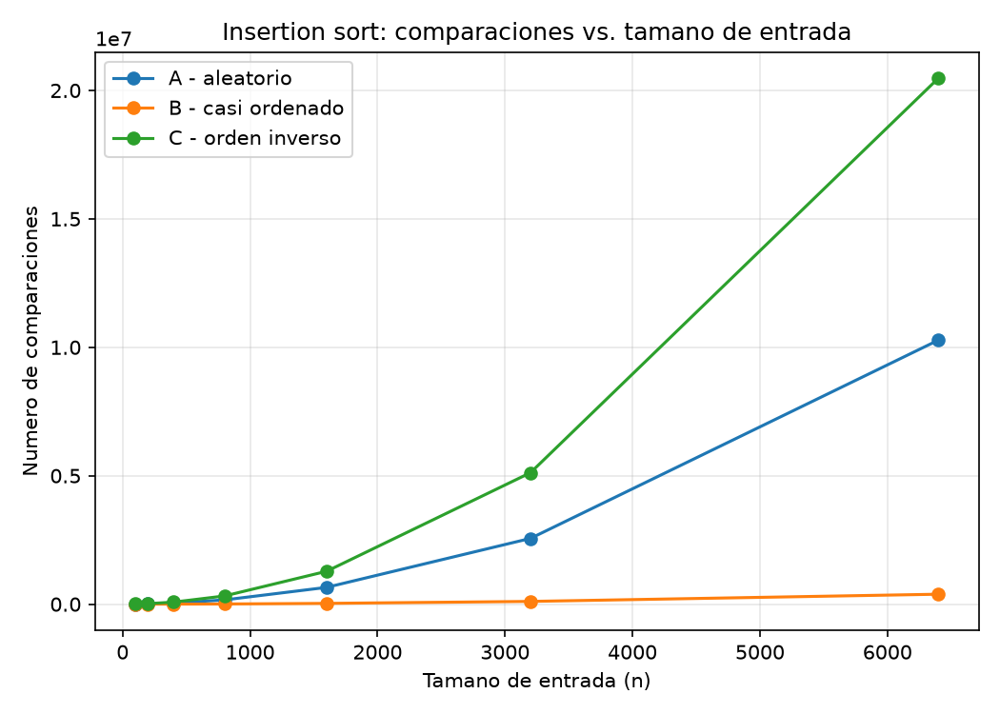
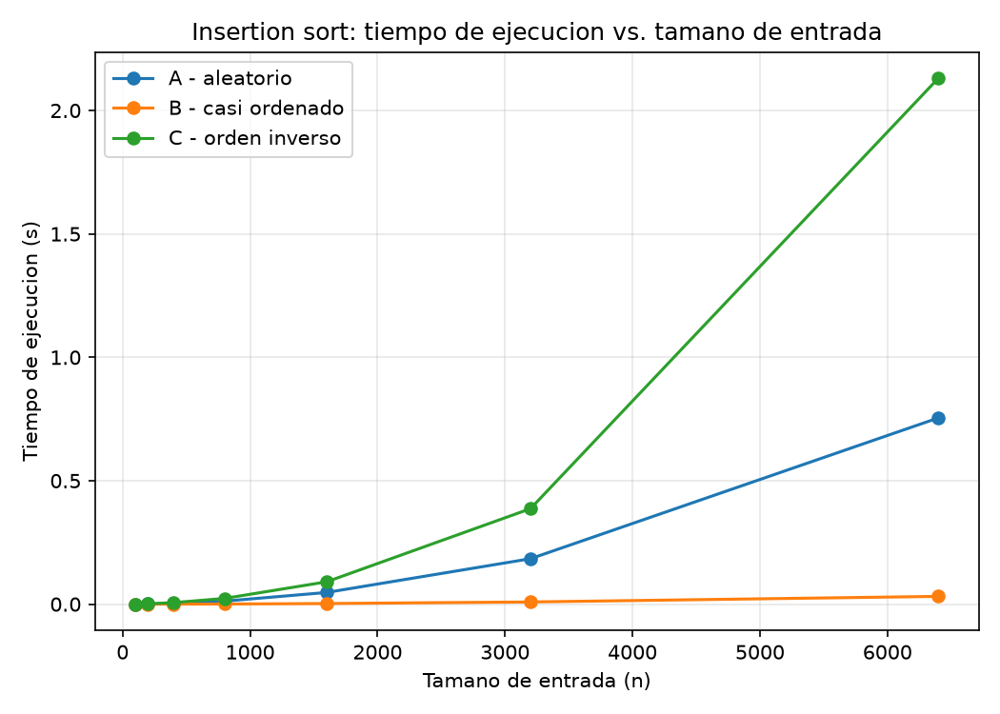
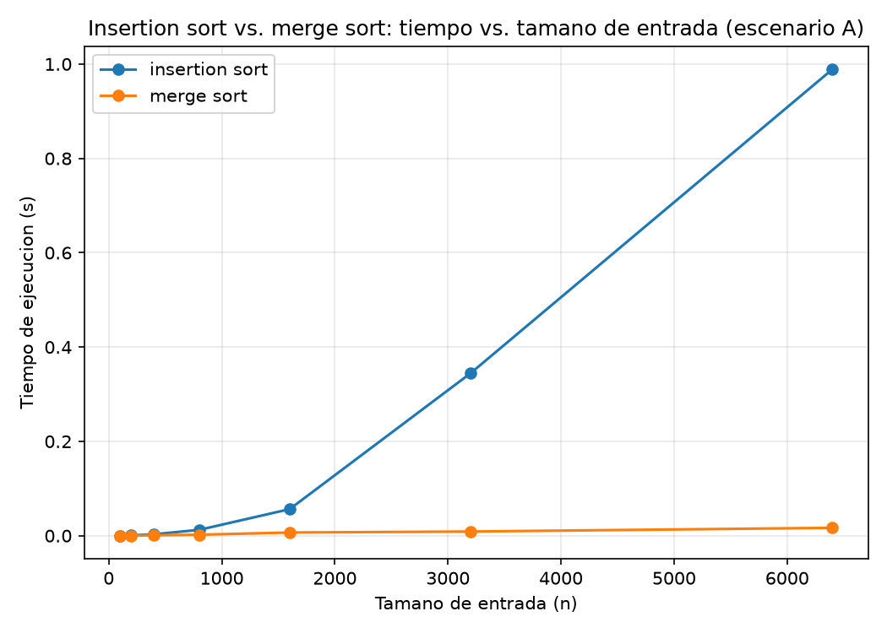

# Laboratorio evaluativo 01 — Fundamentos, complejidad y recurrencias

Juan Correa

## Instrucciones para reproducir el experimento

El repositorio usa un entorno virtual (`venv/`) creado en su raíz, con `matplotlib` instalado y registrado en `requirements.txt`. Desde la raíz del repositorio:

```
# activar el entorno (Windows, PowerShell)
venv\Scripts\Activate.ps1

# si el entorno aún no existe, crearlo e instalar dependencias
python -m venv venv
venv\Scripts\Activate.ps1
pip install -r requirements.txt
```

Con el entorno activado:

```
cd laboratorios/evaluativo1
python parte3_casos.py
python parte4_complejidad.py
```

Cada script imprime en consola los tiempos y las comparaciones medidas, y regenera las gráficas correspondientes dentro de `graficas/`. Las semillas de los generadores aleatorios están fijadas en el código, de modo que los resultados son reproducibles.

## Parte 1 — Analizar el algoritmo antes de comprar hardware

La pregunta no es si Tamiza ordena bien los registros, sino si los ordena a tiempo: son dos propiedades distintas de un algoritmo. La corrección responde a si el resultado que produce es el esperado —dado un lote de 1.200.000 índices de riesgo, ¿queda ordenado de mayor a menor?—. La eficiencia responde a si ese resultado correcto se obtiene dentro de los recursos disponibles, en este caso una ventana de cuatro horas entre las 2:00 y las 6:00 a. m. Insertion sort en Tamiza es correcto: ocho años de uso lo confirman y nadie ha reportado una lista mal ordenada. Lo que reportan las últimas semanas no es un problema de corrección sino de eficiencia: el proceso no alcanza a terminar, no que termine con un resultado equivocado. La restricción concreta que se incumple es esa ventana de cuatro horas; al crecer el volumen de 20.000 a 1.200.000 registros, ese compromiso de tiempo dejó de cumplirse tres veces.

Que un algoritmo sea correcto nunca implica que sea eficiente, porque la corrección no dice nada sobre cuántos pasos toma llegar al resultado: solo garantiza que, dado tiempo suficiente, ese resultado es el correcto. Insertion sort hace, en el peor caso, un número de comparaciones que crece con el cuadrado del tamaño de la entrada. Multiplicar la entrada por 60 —de 20.000 a 1.200.000— no multiplica el trabajo por 60, sino por 60², es decir, por 3.600. Ese es el fenómeno que explica por qué un sistema que sobraba de tiempo durante años, de un momento a otro deja de alcanzar: el trabajo no creció en la misma proporción que los datos que procesa.

Duplicar la velocidad del servidor no corrige esto porque actúa sobre la constante del problema, no sobre su forma de crecimiento: reduce a la mitad el tiempo de cualquier tarea de tamaño fijo, pero no cambia que el trabajo siga creciendo con el cuadrado de n. Si el volumen de registros sigue aumentando —el programa ya se amplió una vez, de cuatro municipios a todo el departamento—, ese servidor más rápido volverá a quedarse corto en pocos ciclos de crecimiento, y la Secretaría enfrentará otra vez la misma decisión con un servidor más caro ya comprado. Cambiar el algoritmo por uno cuyo crecimiento sea más lento que el cuadrático ataca la causa, en lugar de aplazarla.

Un ejemplo distinto de la misma trampa: un script personal para depurar una carpeta de fotos de respaldo, que comparaba cada foto contra todas las demás para detectar duplicados antes de subirlas a un servicio en la nube. El script era correcto —nunca dejó pasar un duplicado—, pero el trabajo crecía con el cuadrado de la cantidad de fotos, porque comparaba cada par. Con unas 3.000 fotos corría en segundos; al llegar a cerca de 40.000, el respaldo nocturno, pensado para completarse en menos de una hora, tardaba más de un día y nunca alcanzaba a terminar antes de que el equipo se apagara.

## Parte 2 — Responsabilidad ambiental y ética de la implementación

La dimensión ambiental de esta decisión no es abstracta: cada comparación que ejecuta el algoritmo consume ciclos de CPU, y cada ciclo de CPU consume electricidad. Un proceso que tarda, para el mismo volumen de datos, siete veces más que otro no es equivalente en huella energética aunque ambos produzcan la misma lista ordenada: el más lento mantiene el servidor bajo carga siete veces más tiempo, consumiendo siete veces más energía por cada corrida. Y este proceso no corre una sola vez: corre todas las madrugadas, durante los años que el sistema siga en producción. Un algoritmo con peor complejidad no es un gasto puntual, es un gasto que se repite cada noche del calendario, de forma indefinida, y que además crece a medida que el volumen de registros del programa aumenta. Elegir el algoritmo equivocado para un proceso diario compromete un consumo energético recurrente, no un costo que se paga una sola vez.

La dimensión ética es más directa todavía, porque en Tamiza el ordenamiento no es un ejercicio académico: decide en qué orden se llama a personas con un resultado de riesgo cardiovascular pendiente de gestión. Hay al menos dos formas concretas en que un algoritmo lento o que falla perjudica a alguien identificable. La primera: si el proceso no termina antes de las 6:00 a. m., el centro de contacto trabaja con una lista parcial, no ordenada por riesgo, como ya ocurrió tres veces. Un paciente con un índice de riesgo alto puede quedar fuera de esa lista parcial simplemente porque el ordenamiento no alcanzó a incluirlo a tiempo; el costo de ese error lo asume directamente el paciente, que pierde uno o más días antes de ser contactado para una valoración que, en un caso cardiovascular, puede ser urgente. La segunda: si por presión de tiempo alguien decide truncar la lista o generarla con un criterio distinto al índice de riesgo, los operadores del centro de contacto terminan llamando en un orden que no refleja el riesgo real, y son ellos quienes cargan con la responsabilidad operativa de una decisión que no tomaron. En ambos casos la Secretaría asume el costo reputacional y legal de un sistema que no cumplió su función, pero quien primero paga el costo humano es el paciente que debía haber sido llamado antes.

Hay una tensión propia de este caso que no se resuelve solo con que el proceso termine rápido: el orden mismo de la lista determina a quién se llama primero. Eso impone una obligación adicional sobre la corrección del ordenamiento, más allá del tiempo: no basta con que el algoritmo sea rápido, tiene que preservar con exactitud el criterio de prioridad esperado, porque un error de ordenamiento aquí no es una fila movida en un reporte interno, es un paciente de alto riesgo que queda detrás de otro que lo necesitaba menos. Esa responsabilidad obliga a que cualquier cambio de algoritmo, incluido el que se recomienda en este informe, se valide no solo en tiempo de ejecución sino en que produzca exactamente el mismo orden por riesgo, sin introducir inconsistencias en los empates ni errores silenciosos en el resultado final.

## Parte 3 — Peor caso, mejor caso y caso promedio, demostrados en Python

Código de esta parte: [algoritmos.py](algoritmos.py), [datos.py](datos.py), [parte3_casos.py](parte3_casos.py).

### 3.1 — Explicación

El **mejor caso** es el mínimo de comparaciones (o de tiempo) que el algoritmo puede llegar a hacer, tomado sobre todas las entradas posibles de un tamaño n fijo: no es "una entrada rápida cualquiera", es la entrada concreta, de ese tamaño, para la que el algoritmo hace el menor trabajo posible. El **peor caso** es el máximo, tomado igualmente sobre todas las entradas posibles de tamaño n fijo: es la garantía que se le puede dar a un cliente de que el proceso "nunca va a tardar más que esto", sin importar qué entrada concreta llegue ese día. El **caso promedio** es el promedio de comparaciones o tiempo, tomado sobre una distribución de las entradas posibles de tamaño n —típicamente asumiendo que cualquier orden de los datos es igualmente probable—; no es un punto intermedio elegido a ojo entre mejor y peor caso, es un valor calculado, o en este laboratorio medido, sobre entradas representativas del mismo tamaño.

Para decidir si el algoritmo de Tamiza entra en producción usaría el **peor caso**, porque la ventana de cuatro horas es una restricción dura, no una expectativa que se cumple en promedio. Al sistema le puede llegar, cualquier madrugada, el escenario más desfavorable —por ejemplo una migración completa desde el sistema legado—, y el proceso tiene que caber en la ventana también ese día. Diseñar con base en el caso promedio equivale a aceptar que, en una fracción de las noches, el proceso simplemente no termine, que es exactamente lo que ya ocurrió tres veces.

Predicción, antes de medir: para insertion sort ordenando de mayor a menor, el escenario C (orden inverso, que llega ordenado de menor a mayor) exige mover cada elemento nuevo hasta el principio de la lista, así que debería ser el peor caso. El escenario B (casi ordenado, 98 % ya en el orden que el algoritmo produce) debería ser el mejor caso, porque la mayoría de los elementos no necesita moverse. El escenario A (aleatorio) debería quedar entre los dos y aproximar el caso promedio.

### 3.2 — Demostración experimental





Las mediciones confirman la predicción. En n = 6.400, el escenario C (orden inverso) exige 20.476.800 comparaciones y 1,95 s, muy por encima del escenario A (aleatorio), con 10.279.781 comparaciones y 1,30 s, y muy por encima del escenario B (casi ordenado), con apenas 387.612 comparaciones y 0,04 s. El escenario C es, en efecto, el peor caso: cada elemento nuevo debe recorrer toda la porción ya ordenada antes de encontrar su lugar. El escenario B es el mejor caso: al estar casi en el orden final, la mayoría de los elementos se inserta con una sola comparación. El escenario A queda de forma consistente entre ambos extremos en las siete mediciones, y se comporta como el caso promedio: ni el mínimo trabajo posible ni el máximo, sino el que resulta de un orden típico de llegada sin ninguna estructura previa.

## Parte 4 — Complejidad de merge sort e insertion sort: cálculo y validación

Código de esta parte: [parte4_complejidad.py](parte4_complejidad.py).

### 4.1 — Cálculo teórico

**Recurrencia de merge sort.** Cada llamada divide la lista en dos mitades de tamaño n/2, así que el término `2T(n/2)` corresponde a los dos subproblemas recursivos. El término `Θ(n)` corresponde al costo de combinar: la función `combinar` (líneas 60–74 de [algoritmos.py](algoritmos.py)) recorre las dos mitades ya ordenadas una sola vez, comparando sus frentes y copiando cada elemento exactamente una vez a la lista fusionada, lo cual toma un tiempo proporcional al tamaño total n de esa llamada. La recurrencia completa es:

```
T(n) = 2T(n/2) + Θ(n)
```

Se resuelve por el método maestro. Identificando los ingredientes: a = 2 (dos subproblemas), b = 2 (cada uno de la mitad del tamaño), f(n) = Θ(n) (costo de combinar). Se calcula n^(log_b a) = n^(log_2 2) = n^1 = n. Comparando f(n) con ese valor: f(n) = Θ(n) coincide exactamente con n^(log_b a) = Θ(n) (el exponente k de un factor logarítmico adicional es 0), así que aplica el segundo caso del método maestro, y la solución es:

```
T(n) = Θ(n^(log_b a) · log n) = Θ(n log n)
```

**Insertion sort, línea a línea.** Sobre el código de `insertion_sort` (líneas 21–31 de [algoritmos.py](algoritmos.py)): el ciclo `for` (línea 21) se ejecuta n − 1 veces, una por cada elemento a insertar. Dentro de él, `clave` y `j` (líneas 22–23) se ejecutan también n − 1 veces cada una. El ciclo `while` (línea 24) se ejecuta, en la iteración i-ésima, `tᵢ + 1` veces, donde `tᵢ` es el número de elementos que hay que desplazar para insertar el elemento i en su lugar; la comparación de la línea 26 se ejecuta esas mismas `tᵢ + 1` veces, y el desplazamiento de la línea 27 se ejecuta `tᵢ` veces. La línea 31 se ejecuta n − 1 veces. El costo total es proporcional a `Σ (tᵢ + 1)` para i entre 1 y n − 1.

En el **mejor caso**, la lista ya llega en el orden que el algoritmo produce y cada elemento nuevo se compara una sola vez sin desplazarse: `tᵢ = 0` para todo i, la suma vale n − 1, y el costo total es Θ(n). En el **peor caso**, cada elemento nuevo debe recorrer todos los anteriores: `tᵢ = i`, la suma es `Σ i` para i entre 1 y n − 1, es decir `n(n − 1)/2`, y el costo total es Θ(n²). El caso promedio, tomando cualquier orden de llegada como igualmente probable, tiene en promedio `tᵢ ≈ i/2` desplazamientos por elemento, lo que mantiene el mismo orden de crecimiento Θ(n²), solo con una constante menor.

| Algoritmo | Mejor caso | Peor caso | Caso promedio |
|---|---|---|---|
| Insertion sort | Θ(n) | Θ(n²) | Θ(n²) |
| Merge sort | Θ(n log n) | Θ(n log n) | Θ(n log n) |

### 4.2 — Validación experimental



La curva de insertion sort crece de forma marcadamente cuadrática: entre n = 3.200 y n = 6.400, el tamaño se duplica y el tiempo pasa de 0,247 s a 0,967 s, un factor cercano a 4, consistente con Θ(n²). La curva de merge sort, en cambio, se mantiene casi plana en esta escala: en el mismo rango pasa de 0,007 s a 0,015 s, un crecimiento mucho más lento que el de insertion sort, consistente con Θ(n log n). Para Tamiza, merge sort es la mejor opción: su curva se aleja de la de insertion sort desde los tamaños más pequeños de la prueba y la distancia se amplía a medida que crece n, que es justamente la situación de Tamiza, donde n va a seguir creciendo.

Este resultado coincide con las complejidades calculadas en 4.1: Θ(n²) crece mucho más rápido que Θ(n log n), y eso es exactamente lo que muestran las dos curvas. En esta prueba, merge sort resultó más rápido que insertion sort incluso en el tamaño más pequeño medido (n = 100); a esta escala de datos, en Python, el costo por comparación de insertion sort ya pesa más que el costo de recursión y de las listas intermedias de merge sort, así que no se alcanza a observar el cruce donde insertion sort sería preferible por sus constantes más bajas.

### 4.3 — Concepto técnico a la Secretaría de Salud

Recomiendo reemplazar insertion sort por merge sort como algoritmo de ordenamiento del proceso nocturno de Tamiza. El canal de origen del lote puede cambiar sin aviso —cargue directo, reproceso o migración del legado—, y merge sort es la opción que responde bien a los tres por igual: su complejidad es Θ(n log n) en el mejor, el peor y el caso promedio, según se calculó en la sección 4.1 y se confirmó en la gráfica de la sección 4.2. Esa estabilidad evita mantener una implementación distinta por escenario, o peor, decidir cuál usar según de dónde venga el lote del día: una sola implementación cubre los tres casos sin sorpresas.

Con los datos medidos, insertion sort no cabe en la ventana de cuatro horas y merge sort sí, con margen amplio. Tomando la medición sobre el escenario aleatorio en n = 6.400 (0,967 s, tabla de la sección 4.2) y escalando por el factor cuadrático que le corresponde a insertion sort hasta 1.200.000 registros —un aumento de tamaño de 187,5 veces implica un aumento de trabajo de 187,5² ≈ 35.156 veces—, el tiempo estimado ronda las 9,4 horas, muy por encima de la ventana disponible; esto es una estimación por extrapolación, no una medición directa sobre 1.200.000 registros. Tomando la medición de merge sort en el mismo n = 6.400 (0,015 s) y escalando por el factor n log n correspondiente, el tiempo estimado para 1.200.000 registros ronda los 4,5 segundos, con margen más que suficiente frente a las cuatro horas disponibles.

Frente a la propuesta de duplicar la velocidad del servidor: un servidor el doble de rápido reduciría a la mitad el tiempo de insertion sort, llevando la estimación de 9,4 horas a cerca de 4,7 horas. Eso seguiría sin caber en la ventana de cuatro horas, y volvería a quedarse corto en cuanto el programa siga creciendo, obligando a repetir la misma compra más adelante sin resolver nada. Cambiar de algoritmo resuelve el problema con el hardware actual y deja margen para el crecimiento futuro del programa; comprar hardware más rápido pospone el problema sin resolverlo.

Hay una consideración adicional, distinta del tiempo, que vale la pena dejar registrada: merge sort necesita memoria adicional proporcional al tamaño del lote, porque construye listas nuevas al combinar, mientras que insertion sort ordena sobre la lista original sin memoria extra significativa. Para 1.200.000 registros esto es manejable en cualquier servidor de este tipo, pero conviene tenerlo presente si en el futuro el volumen de registros crece en uno o dos órdenes de magnitud más. También vale la pena advertir que el escenario B (casi ordenado) deja de ser una ventaja notable con merge sort, a diferencia de insertion sort: si el flujo de reproceso cambia y el lote deja de llegar casi ordenado, el desempeño de merge sort no se ve afectado, mientras que el de insertion sort se degrada de inmediato a su peor caso. Eso hace de merge sort la opción más robusta ante cambios en la forma en que llegan los datos, no solo la más rápida en las condiciones actuales.
