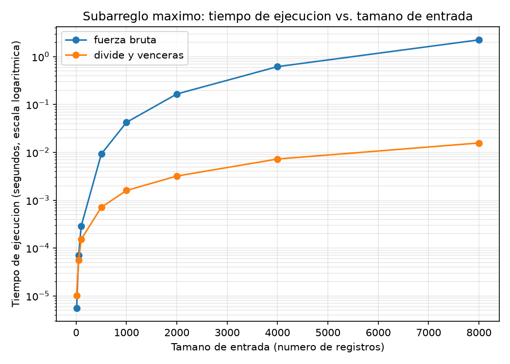

# Laboratorio evaluativo 02 - Dividir y vencer

Juan Pablo Correa Buitrago

## Instrucciones para reproducir el experimento

El repositorio usa el entorno virtual (`venv/`) de la raíz, con `matplotlib` instalado y registrado en `requirements.txt`. Desde la raíz del repositorio:

```
venv\Scripts\Activate.ps1
cd laboratorios/lab2-divide-y-vencer
python pruebas.py
python medicion.py
```

`pruebas.py` corre los casos de verificación y termina imprimiendo "Todas las pruebas pasaron" si todo quedó correcto. `medicion.py` imprime en consola los tiempos medidos y regenera la gráfica en `graficas/tiempo_vs_n.png`.

## Parte 1 - Implementar y verificar las dos soluciones

Código: [subarreglo.py](subarreglo.py), [pruebas.py](pruebas.py).

Las tres funciones del problema quedaron en `subarreglo.py`. `subarreglo_fuerza_bruta` prueba todos los pares de días acumulando la suma dentro del ciclo interno, sin recalcularla desde cero. `suma_cruzada` hace dos barridos lineales desde el punto medio hacia cada lado y devuelve la suma de ambos lados. `subarreglo_maximo` resuelve el problema por división: calcula el mejor tramo de la mitad izquierda, el de la mitad derecha y el que cruza el centro, y devuelve el mayor de los tres, sin llamar en ningún momento a la fuerza bruta.

La verificación en `pruebas.py` cubre los seis casos pedidos: la serie de ocho días del enunciado (suma esperada 17), una serie de un solo elemento positivo y otra negativa, una serie con todos los valores negativos, una serie con todos los valores positivos, un caso en el que el mejor tramo cruza el punto medio (la serie clásica `[-2, 1, -3, 4, -1, 2, 1, -5, 4]`, cuyo mejor tramo es `[4, -1, 2, 1]` con suma 6), y 25 listas generadas al azar con una semilla fija, de tamaños entre 2 y 60, en las que se exige que fuerza bruta y divide y vencerás coincidan. Ninguna de las dos funciones modifica la lista que recibe, y ninguna usa `sorted()`, `sort()` ni funciones de ordenamiento de ninguna librería.

## Parte 2 - Medir y graficar

Código: [medicion.py](medicion.py).



Se midieron ocho tamaños de entrada (10, 50, 100, 500, 1000, 2000, 4000 y 8000), generados con una semilla fija y valores enteros entre -100 y 100, usando la misma lista para ambos algoritmos en cada tamaño. Antes de medir, el script verifica que las dos soluciones den la misma suma para esa lista. Cada medición se repitió siete veces con `time.perf_counter()`, cronometrando solo la llamada al algoritmo, y se tomó el valor mínimo de esas siete corridas: el ruido del sistema operativo solo puede alargar una medición, nunca acortarla, así que el mínimo es el que mejor representa el costo real del algoritmo. El eje del tiempo quedó en escala logarítmica porque, en escala normal, la curva de divide y vencerás queda pegada al fondo y no se alcanza a leer su forma.

## Parte 3 - Análisis

### 1. Recurrencia

La recurrencia de `subarreglo_maximo` es:

```
T(n) = 2 T(n/2) + O(n)
```

`2 T(n/2)` son las dos llamadas recursivas, sobre la mitad izquierda y la mitad derecha, cada una de tamaño n/2. `O(n)` es el costo de `suma_cruzada`: un barrido lineal hacia la izquierda de a lo sumo n/2 elementos y otro hacia la derecha de a lo sumo los otros n/2.

Por el método maestro: a = 2, b = 2, f(n) = O(n). n elevado a (log base 2 de 2) da n. Como f(n) = O(n) tiene ese mismo orden (exponente logarítmico adicional 0), se cumple el segundo caso, y T(n) = O(n log n).

La fuerza bruta es O(n al cuadrado) porque recorre todos los pares (i, j) con i menor o igual a j: para i = 0 evalúa n valores de j, para i = 1 evalúa n - 1, y así hasta 1. La suma n + (n - 1) + ... + 1 es n (n + 1) / 2, del mismo orden que n al cuadrado.

### 2. Lo medido contra lo esperado

De n = 4000 a n = 8000 (se duplica el tamaño): la fuerza bruta pasa de 0.617 s a 2.239 s, factor de 3.6; divide y vencerás pasa de 0.00726 s a 0.01569 s, factor de 2.2. Coincide con lo esperado: O(n al cuadrado) predice que al duplicar n el tiempo se multiplica por cuatro, y O(n log n) predice un factor apenas mayor que 2.

### 3. Tamaños pequeños

Sí hay un cruce, y aparece muy temprano: en n = 10 la fuerza bruta todavía gana (0.000006 s contra 0.000010 s), pero en n = 50 divide y vencerás ya es más rápido (0.000056 s contra 0.000071 s). El cruce ocurre entre esos dos tamaños. Tiene sentido: la fuerza bruta hace operaciones muy simples, mientras que divide y vencerás paga de entrada el costo de la recursión; ese costo fijo es tan pequeño que basta con que n pase de 10 a unas pocas decenas para que la forma de crecimiento empiece a dominar.

### 4. ¿Cuándo conviene dividir?

No siempre. Para hallar el máximo de un arreglo de n números, dividirlo a la mitad no mejora nada: la recurrencia sería T(n) = 2 T(n/2) + O(1), porque combinar los dos máximos parciales cuesta una sola comparación. Con f(n) = O(1), n elevado a (log base 2 de 2) da n, que crece más rápido que f(n), así que aplica el primer caso del método maestro y T(n) = O(n): la misma complejidad que recorrer el arreglo una vez, sin ganar nada por dividir. En el subarreglo máximo sí conviene dividir porque combinar cuesta O(n) y esa recurrencia resuelve en O(n log n), mejor que los O(n al cuadrado) de la fuerza bruta. La diferencia está en qué tan caro es combinar: cuando combinar es tan barato como el problema mismo, dividir no aporta; cuando combinar evita el trabajo repetido de la fuerza bruta, dividir sí paga.

### 5. Concepto para la gerente

Recomiendo divide y vencerás. Con 1.500 tiendas y series que van a crecer hasta cientos de miles de registros, la diferencia de orden de crecimiento es decisiva. Escalando la medición en n = 8000 hasta 1.000.000 de registros, sin usar una regla de tres lineal: la fuerza bruta crece con el cuadrado del tamaño, así que un aumento de 125 veces en n implica un aumento de trabajo de 125 al cuadrado, unas 15.625 veces; sobre los 2.239 s medidos, el tiempo estimado ronda las 9.7 horas. Divide y vencerás crece con n log n; esa razón entre los dos tamaños da un aumento de trabajo de aproximadamente 192 veces, y sobre los 0.0157 s medidos el tiempo estimado ronda los 3 segundos. Ambas cifras son estimaciones por extrapolación, no mediciones directas. La fuerza bruta no es viable para el volumen de datos que el equipo planea manejar; divide y vencerás responde en segundos.
